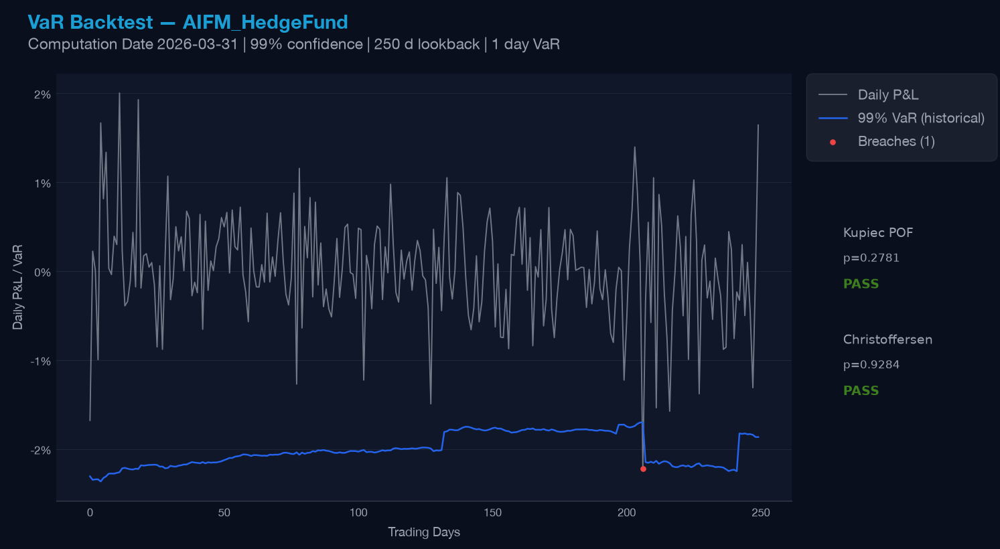
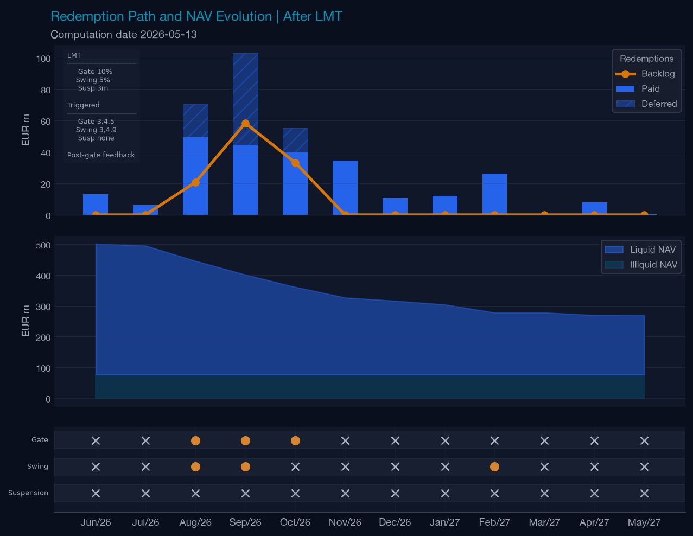
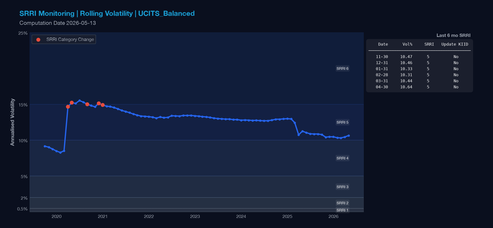
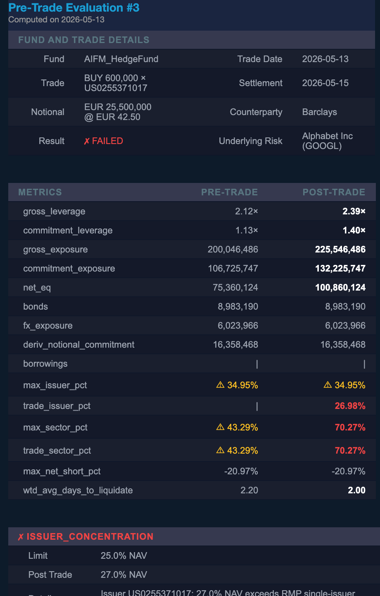

# fund-risk-workflow


[](https://eur-lex.europa.eu/legal-content/EN/TXT/?uri=CELEX%3A32024L0927)
[](https://eur-lex.europa.eu/legal-content/EN/TXT/?uri=CELEX%3A32024L0927)


`fund-risk-workflow` is a Python and notebook-led repository for fund risk workflows using simulated UCITS and AIFM-style fund data. It covers market risk, liquidity risk, redemption pressure, leverage monitoring, pre-trade checks, LMT mechanics and reporting outputs.

---

## Current Coverage

| Workflow | Scope |
| --- | --- |
| AIFM Hedge Fund Long/Short | VaR, Expected Shortfall, backtesting, stress testing, liquidity monitoring, leverage monitoring |
| UCITS Balanced | VaR, SRI, PRIIPs KID example, eligibility checks, LMT mechanics |


## Example outputs

<div style="text-align: center;">
    
</div>

<br>

---
<br>
<div style="text-align: center;">
    
</div>
<br>

---

<br>
<div style="text-align: center;">
    
</div>
<br>


---

<br>
<div style="text-align: center;">
    
</div>
<br>


## Where to start

|  |  |  |
| --- | --- | --- |
| Hedge fund risk workflow | [`notebook`](notebooks/funds/aifm_hedge_fund.ipynb) | [`30 outputs`](fig/AIFM_HedgeFund) |
| UCITS balanced workflow | [`notebook`](notebooks/funds/ucits_balanced.ipynb) | [`13 outputs`](fig/UCITS_Balanced) |
| Liquidity and LMT mechanics | [`notebook`](notebooks/liquidity_management/liquidity_management.ipynb) | [`13 outputs`](fig/UCITS_Balanced_liquidity) |

---

## Risk analytics examples


### Market risk

* VaR
* Expected Shortfall
* VaR backtesting
* P&L attribution
* stress scenarios

### Liquidity risk

* liquidity profiling
* redemption pressure
* investor concentration
* liquidity-adjusted VaR
* selected liquidity stress assumptions

### Leverage and constraints

* leverage monitoring
* issuer and sector concentration examples
* pre-trade checks

### Liquidity Management Tools

The repository includes a simplified LMT mechanics example for a UCITS-style fund under a 12-month redemption scenario. It shows how redemption pressure, liquid asset coverage and tool triggers can be represented in Python.

* redemption gate threshold
* deferred redemption backlog
* swing pricing threshold
* behavioral feedback


---

## Data and assumptions

The repository uses simulated fund, position and market data. Fund data are stored in SQLite. Market data use a Bloomberg-style local pipeline.

Key assumptions:

* fund holdings are simulated
* liquidity buckets are assumption-driven
* LMT thresholds are illustrative
* outputs are reporting-oriented examples, not filing-ready reports

---

## Status and limitations

This repository uses simulated data and simplified assumptions.
Regulatory context: [UCITS Directive 2009/65/EC](https://eur-lex.europa.eu/legal-content/EN/TXT/?uri=CELEX:32009L0065), [AIFMD 2011/61/EU](https://eur-lex.europa.eu/legal-content/EN/TXT/?uri=CELEX:32011L0061), [Commission Delegated Regulation (EU) No 231/2013](https://eur-lex.europa.eu/legal-content/EN/TXT/?uri=CELEX:32013R0231), [Directive (EU) 2024/927](https://eur-lex.europa.eu/legal-content/EN/TXT/?uri=CELEX:32024L0927), [ESMA liquidity stress testing guidelines](https://www.esma.europa.eu/sites/default/files/library/esma34-39-897_guidelines_on_liquidity_stress_testing_in_ucits_and_aifs_en.pdf), [ESMA LMT guidelines](https://www.esma.europa.eu/sites/default/files/2025-04/ESMA34-1985693317-1095_Final_Report_on_the_Guidelines_on_LMTs_of_UCITS_and_open-ended_AIFs.pdf).

Implemented areas include:

* hedge fund market risk and liquidity monitoring
* UCITS-style risk and eligibility examples
* LMT mechanics under redemption pressure
* local data and output generation

Current limitations:

* simulated fund, position and market data
* simplified risk and liquidity assumptions
* illustrative LMT thresholds

A more structured package implementation is under development in `manco-risk`.


---

## Setup

```bash
git clone https://github.com/mrspatbile/fund-risk-workflow
cd fund-risk-workflow
python3 -m venv .venv
source .venv/bin/activate
pip install -e .
python3 -m fund_risk_workflow.data.setup_db
```

### Cleaning regenerated outputs

Use the cleanup script to remove regenerated output folders when you want to rerun the workflow from generated source files.

The script removes:

- `data/positions/`
- `data/reports/`
- `data/daily_exports/`

It does not remove:

- `data/risk_management.db`
- `data/yf_cache/`

This means the database is preserved. If you delete positions and want the database to reflect regenerated position files, rerun the position generation and database setup workflow afterwards.

```bash
# Dry-run: shows what would be deleted
python3 scripts/clean_data_outputs.py

# Confirm deletion
python3 scripts/clean_data_outputs.py --confirm
```

