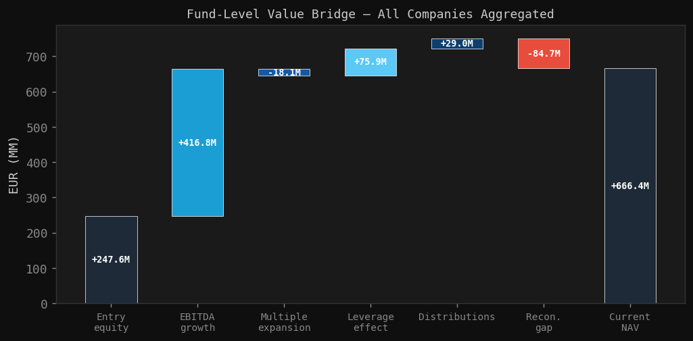

# manco-risk-mngmt


AIFM and UCITS risk management workflow for Luxembourg ManCos. VaR, ES, stress testing, liquidity risk, pre-trade compliance and regulatory reporting across six fund types including illiquid strategies. Simulated Bloomberg pipeline. SQLite via SQLAlchemy ORM. Python.

---

## What this is

A structured simulation of the risk analyst workflow operating under Luxembourg regulatory oversight — UCITS and AIFM frameworks supervised by the CSSF. Built to develop and demonstrate deep familiarity with the regulations and the practical difficulties of implementing them.

This is not a production system. Valuations come from simulated external appraiser or administrator inputs, consistent with AIFMD Article 19 (independent valuation boundary). The valuation date is static and portfolio positions are fixed except for the PE fund. Real market data for liquid assets comes from yfinance.

---

## Fund coverage

| Fund | Type | Key risk focus |
|---|---|---|
| UCITS Balanced | UCITS | VaR limits, SRRI, eligibility, pre-trade |
| AIFM Hedge Fund L/S | AIFM liquid | Leverage, stress, liquidity, Annex IV |
| AIFM PE Buyout | AIFM illiquid | IRR, multiples, PME, NAV, ESG |
| AIFM Private Debt | AIFM illiquid | Credit risk, covenants, leverage, Annex IV |
| AIFM Real Estate | AIFM illiquid | LTV, rental stress, direct property, ESG |
| AIFM Infrastructure Core | AIFM illiquid | DSCR/LTV, concession duration, inflation, ESG |

---

## Risk metrics and analytics

**Market and fund risk**
- VaR: historical simulation, parametric, Monte Carlo
- Expected Shortfall (ES)
- VaR backtest: Kupiec unconditional coverage, Christoffersen independence tests
- P&L attribution

**Liquidity risk**
- Liquidity profiling in time buckets
- Redemption stress testing
- Investor concentration
- Liquidity-adjusted VaR

**Pre-trade compliance**
- VaR impact check before execution
- Issuer concentration and leverage limits
- UCITS eligibility rules
- AIFM Hedge Fund and Private Debt flavours

**Private asset analytics**
- PE: XIRR, fund IRR, MOIC/DPI/RVPI, value bridge, Long-Nickels PME benchmark
- Infrastructure: DSCR/LTV covenant profiles with breach and waiver tracking, inflation linkage, weighted concession duration, cashflow coverage, yield-capitalisation NAV stress
- Leverage classification per AIFMD Article 7 (gross and commitment methods)

**ESG**
- Listed assets via mock Bloomberg data
- PE and infrastructure via independent appraiser data
- SFDR PAI-ready DataFrames for private asset funds

**Liquidity Management Tools (AIFMD II)**
LMT trigger simulation covering gate, swing pricing and suspension across a 12-month redemption scenario. Implements the dynamic liquidity risk framework required under AIFMD II Directive 2024/927/EU and ESMA34-671404336-1364 (April 2025 LMT guidelines).

- Gate: caps monthly redemptions at a threshold percentage of NAV, defers excess into a running backlog
- Swing pricing: dilution levy applied when gross redemptions exceed the swing threshold, protecting remaining investors
- Suspension: triggers when consecutive gate breaches and backlog as a percentage of liquid NAV both exceed defined thresholds
- NAV sleeve decomposition: liquid sleeve depletes from outflows, illiquid sleeve remains fixed, modelling the structural risk of convergence toward the illiquid floor
- Output: month-by-month DataFrame with gate, swing and suspension flags, backlog evolution and NAV composition

## Output Examples

**VaR backtest — breach flags and test statistics**


*Kupiec and Christoffersen tests across the hedge fund portfolio. Breach dates flagged on the return series.*

---

**PE value bridge and exit attribution**



*Entry-to-exit value decomposition across portfolio companies.*

---

**Board Risk Report — executive summary page**


*Monthly board-ready PDF generated via `board_report.py`. AIFMD Article 15 internal governance format. Covers VaR, stress, liquidity, and breach log.*

---

**Liquidity monitoring dashboard**

PLACEHOLDER for image

*Fund-level liquidity bucket profiles, redemption stress scenarios, and investor concentration analysis.*

---

## Regulatory scope

- UCITS Directive 2009/65/EC and Luxembourg implementation via CSSF
- AIFMD 2011/61/EU and Luxembourg implementation via CSSF (Law of 12 July 2013)
- AIFMD II 2024/927/EU — LMT disclosures and expanded Annex IV fields implemented for PE and infrastructure funds
- EU 231/2013 — leverage calculation (gross and commitment); Articles 46-49 risk management; Article 7 project finance treatment
- ESMA technical guidance v1.7 July 2024 — Annex IV field definitions
- ESMA/2020/1498 — Annex VI stress testing guidance
- CSSF Regulation 10-04 — organisational and prudential requirements for dual ManCos
- CSSF Regulation 22-05 — sustainability requirements
- IPEV Valuation Guidelines — PE and infrastructure fair value (yield capitalisation)
- AIFMD Article 15 — liquidity management
- AIFMD Article 19 — independent valuation boundary
- SFDR PAI indicators — private asset ESG disclosure context

---

## Regulatory outputs

- **Annex IV** transparency report — AIFMD Article 110, all five AIFM funds, Excel export in CSSF format including AIFMD II expanded fields
- **Annex VI** stress test Excel export — CSSF submission format, cross-fund summary and per-fund sheets
- **Board Risk Report** PDF — AIFMD Article 15 internal governance, monthly cadence

---

## Project structure

```
src/                        # All production modules
  risk_utils.py             # VaR, ES, backtests, stress, liquidity, pre-trade check
  annex_iv.py               # Annex IV report — AIFMD Article 110
  annex_vi_export.py        # Annex VI stress test Excel export
  board_report.py           # Board Risk Report PDF
  pe_utils.py               # PE analytics: IRR, multiples, PME
  infra_utils.py            # Infrastructure analytics: DSCR/LTV, covenants, duration
  database.py               # SQLAlchemy ORM — central data store including infra schema
  enrichment.py             # Position enrichment pipeline
  esg_utils.py              # ESG scoring — listed and private assets
  leverage_config.py        # AIFMD Article 7 leverage classification
  mock_bloomberg.py         # Simulated Bloomberg interface using yfinance cache
  setup_db.py               # Idempotent DB setup
  validate_pipeline.py      # End-to-end pipeline validation

notebooks/                  # One notebook per fund type plus board report and data pipeline
reference_data/             # Fund master, position specs, ticker map, ESG scores, PE and infra assets
tests/                      # Unit tests mirroring src/
data/                       # Gitignored — DB, position files, exports, cache
```

---

## Stack

- Python 3.13
- SQLite via SQLAlchemy ORM
- yfinance — real market data for liquid assets, cached locally
- scipy — parametric VaR and ES distributions
- matplotlib — all charts via shared dark-theme style
- openpyxl — Excel position files and regulatory exports
- Jupyter / JupyterLab — fund notebooks
- GitHub — version control
- Linear — issue tracking
- Claude Code

---

## Known constraints

Valuation inputs for illiquid assets are simulated, consistent with the AIFM operational model where the risk function consumes valuations produced externally by an independent appraiser or fund administrator. There is a separate project implementing a valuation engine in an OOP paradigm.

## Getting started

```python
git clone https://github.com/mrspatbile/manco-risk-mngmt
cd manco-risk-mngmt
python -m venv .venv
source .venv/bin/activate
pip install -e .
python src/setup_db.py
```
---

> Built by [Patricia Cruz](https://github.com/mrspatbile) — CFA, PhD Finance, Luxembourg