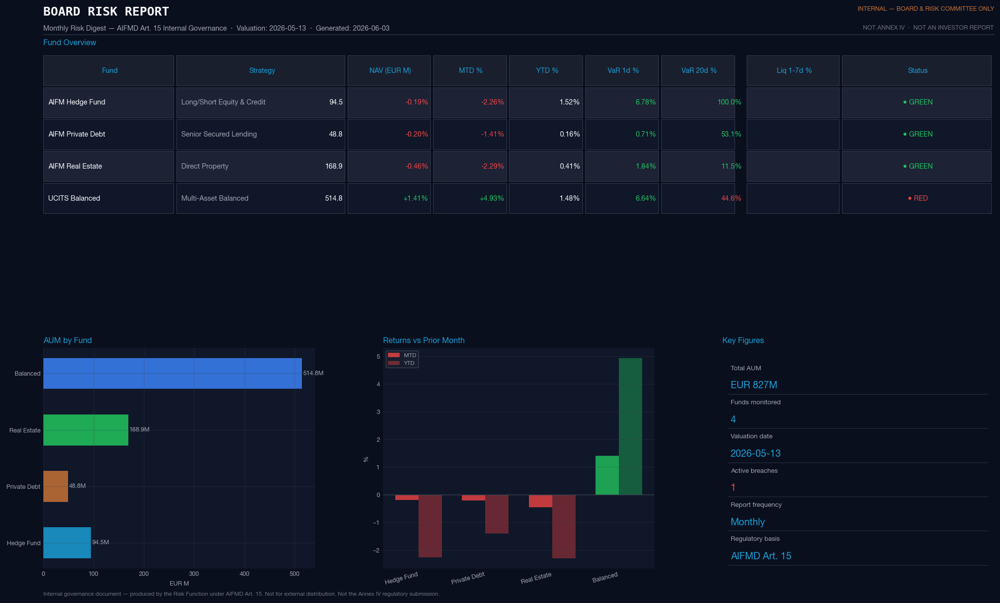
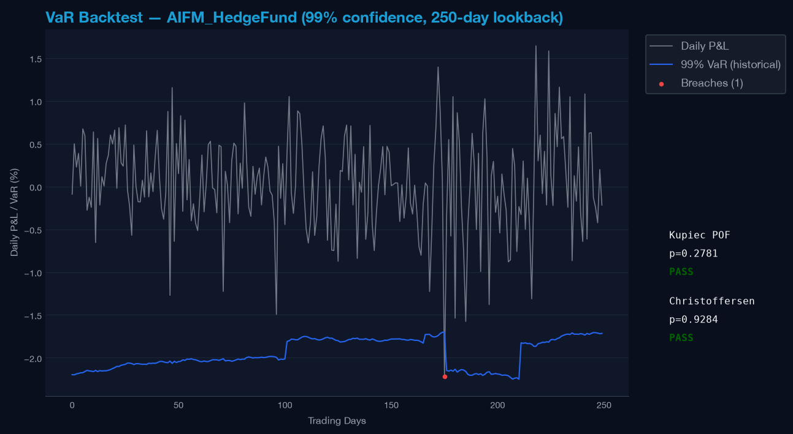
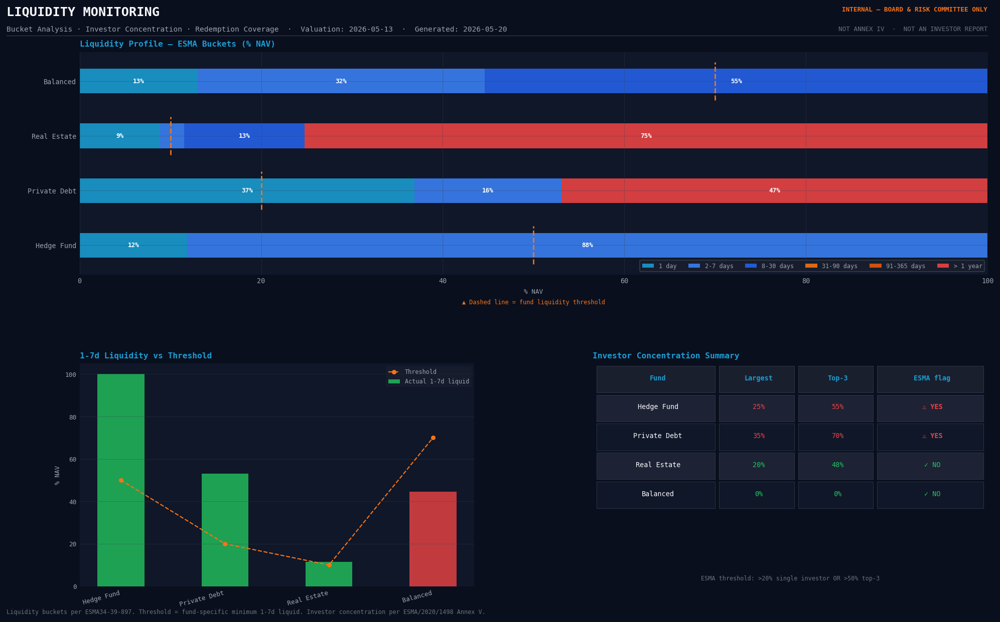

# manco-risk-mngmt


[](https://eur-lex.europa.eu/legal-content/EN/TXT/?uri=CELEX%3A32024L0927)
[](https://eur-lex.europa.eu/legal-content/EN/TXT/?uri=CELEX%3A32024L0927)
[](https://eur-lex.europa.eu/legal-content/EN/TXT/?uri=CELEX%3A32014R1286)

Risk management and regulatory reporting system covering UCITS and AIFMD II frameworks across six fund types including illiquid strategies. Includes liquidity stress testing and LMT calibration simulation. Market data ingested via a simulated Bloomberg pipeline, positions and fund data stored in SQLite via SQLAlchemy ORM. Regulatory outputs: Annex IV, liquidity stress reports, and board risk reports.

---


## Fund coverage

Analytics include Annex IV reporting, liquidity stress testing per ESMA/2020/1498, 
LMT simulation, and pre-trade compliance check. 
Coverage varies by fund type and strategy.

| Fund | Type | Scope |
|---|---|---|
| UCITS Balanced | UCITS | VaR, SRI, PRIIPs KID, eligibility, pre-trade, |
| AIFM Hedge Fund L/S | AIFM liquid | Leverage, stress, liquidity stress, LMT, Annex IV, pre-trade |
| AIFM PE Buyout | AIFM illiquid | IRR, MOIC/DPI/RVPI, Long-Nickels PME, value bridge, ESG PAI |
| AIFM Private Debt | AIFM illiquid | Credit risk, covenant monitoring, leverage, Annex IV, ESG PAI |
| AIFM Real Estate | AIFM illiquid | LTV, rental stress, yield-capitalisation NAV|
| AIFM Infrastructure Core | AIFM illiquid | DSCR/LTV, concession duration, inflation linkage|

---
## Risk analytics

**Market risk**: VaR (historical, parametric), Expected Shortfall, VaR backtest (Kupiec, Christoffersen), P&L attribution.

**Liquidity risk**: liquidity profiling in time buckets, redemption stress testing 
per ESMA/2020/1498, investor concentration, liquidity-adjusted VaR.

**Pre-trade compliance**: VaR impact, issuer concentration, leverage limits, 
UCITS eligibility (Articles 50, 52).

**ESG**: listed assets via simulated Bloomberg data, private assets via independent 
appraiser inputs, SFDR PAI-ready DataFrames.

---

## Liquidity Management Tools (AIFMD II)

LMT trigger simulation covering gate, swing pricing and suspension across a 
12-month redemption scenario. Implements the dynamic liquidity risk framework 
required under AIFMD II Directive 2024/927/EU, Delegated Regulation EU 2026/466, 
and ESMA34-671404336-1364.

- **Gate**: caps monthly redemptions at a threshold percentage of NAV, defers 
  excess into a running backlog
- **Swing pricing**: dilution levy applied when gross redemptions exceed the swing 
  threshold, protecting remaining investors from transaction cost dilution
- **Suspension**: triggers when consecutive gate breaches and backlog as a 
  percentage of liquid NAV both exceed defined thresholds
- **NAV sleeve decomposition**: liquid sleeve depletes from outflows, illiquid 
  sleeve remains fixed, modelling the structural convergence risk toward the 
  illiquid floor
- **Output**: month-by-month DataFrame with gate, swing and suspension flags, 
  backlog evolution, and NAV composition

LMT thresholds are calibrated against redemption stress test output per ESMA/2020/1498.

---

## Output Examples


<!-- **Board Risk Report — executive summary page**



*Monthly board-ready PDF generated via `board_report.py`. AIFMD Article 15 internal governance format. Covers VaR, stress, liquidity, and breach log.* -->

<!-- --- -->


**VaR backtest — breach flags and test statistics**



*Kupiec and Christoffersen tests across the hedge fund portfolio. Breach dates flagged on the return series.*

---
**Liquidity monitoring dashboard**



---

## Regulatory scope

| Regulation | Coverage |
|---|---|
| UCITS Directive 2009/65/EC | Luxembourg: Law of 17 December 2010 |
| AIFMD 2011/61/EU | Luxembourg: Law of 12 July 2013 |
| AIFMD II 2024/927/EU | Luxembourg: Law of 3 March 2026 — LMT framework, expanded Annex IV |
| EU 231/2013 | Leverage calculation Annex II, risk management Articles 46-49 |
| Delegated Regulation EU 2026/466 | LMT characteristics RTS |
| ESMA technical guidance v1.7 (July 2024) | Annex IV field definitions |
| ESMA/2020/1498 | Liquidity stress testing guidelines |
| ESMA34-671404336-1364 (March 2026) | LMT selection and calibration |
| CSSF Regulation 10-04 | Organisational requirements for ManCos |
| CSSF Regulation 22-05 | Sustainability requirements |
| IPEV Valuation Guidelines | PE and infrastructure fair value |
| SFDR | PAI indicators for private asset funds |

---

## Regulatory outputs

- **Annex IV** — AIFMD Article 110, all five AIFM funds, including AIFMD II expanded fields
- **Annex VI stress report** (ESMA/2020/1498) — cross-fund summary and per-fund sheets
- **Board Risk Report** — PDF, AIFMD Article 15 internal governance

---

## Stack

Python 3.13 · SQLite via SQLAlchemy ORM · scipy · matplotlib · openpyxl · JupyterLab

---

## Status

Working prototype. Regulatory analytics, outputs, and LMT simulation are functional. 
Notebook code consolidation and architecture refactoring are in progress. Valuation 
inputs for illiquid assets are simulated, consistent with the AIFM model where the 
risk function consumes valuations produced by an independent appraiser or administrator.

## Setup

```bash
git clone https://github.com/mrspatbile/manco-risk-mngmt
cd manco-risk-mngmt
python -m venv .venv
source .venv/bin/activate
pip install -e .
python src/setup_db.py
```
